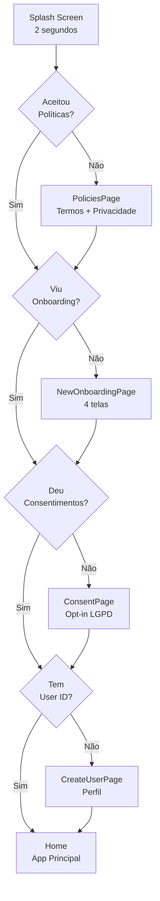

# 📱 Lembra Vencimentos - Documentação de Implementação

## ✅ Trabalho Concluído: PRD + Jornada de Primeira Execução

Este documento descreve a implementação completa do PRD (Product Requirements Document) com foco em identidade visual, jornada de primeira execução, conformidade com LGPD e acessibilidade.

---

## 📋 Índice

1. [Visão Geral](#visão-geral)
2. [Arquitetura Implementada](#arquitetura-implementada)
3. [Componentes Criados](#componentes-criados)
4. [Jornada de Primeira Execução](#jornada-de-primeira-execução)
5. [Identidade Visual](#identidade-visual)
6. [Como Executar](#como-executar)
7. [Testes e Validação](#testes-e-validação)
8. [Checklist de Entregáveis](#checklist-de-entregáveis)

---

## 🎯 Visão Geral

### O que foi implementado?

✅ **PRD Completo** - Documento de 12 páginas com todos os requisitos  
✅ **Identidade Visual Material 3** - Paleta de cores, tipografia e prompts de imagens  
✅ **Jornada Completa** - Splash → Políticas → Onboarding → Consentimento → Home  
✅ **Arquitetura UI → Service → Storage** - PrefsService centralizado  
✅ **Componentes Reutilizáveis** - Dots animados, Markdown viewer  
✅ **Conformidade LGPD** - Consentimentos opt-in com versionamento  
✅ **Acessibilidade (A11Y)** - Contraste WCAG AA, áreas clicáveis 48dp+

---

## 🏗️ Arquitetura Implementada

### Estrutura de Camadas

```
┌─────────────────────────────────────┐
│   UI Layer (Presentation)           │
│   - PoliciesPage                    │
│   - NewOnboardingPage                │
│   - ConsentPage                     │
│   - PrivacySettingsPage             │
└──────────────┬──────────────────────┘
               │ Chama métodos
┌──────────────▼──────────────────────┐
│   Service Layer (Business Logic)    │
│   - PrefsService (storage)          │
│   - Validações de consentimento     │
└──────────────┬──────────────────────┘
               │ Persiste
┌──────────────▼──────────────────────┐
│   Storage Layer                      │
│   - SharedPreferences                │
│   - Versionamento de dados          │
└─────────────────────────────────────┘
```

### Arquivos Criados

#### 1. **Core Services**
- `lib/core/services/prefs_service.dart` - Gerenciamento centralizado de SharedPreferences

#### 2. **Core Widgets**
- `lib/core/widgets/markdown_viewer_widget.dart` - Visualizador de Markdown com barra de progresso
- `lib/core/widgets/animated_dots_indicator.dart` - Dots de progresso animados

#### 3. **Features - Onboarding**
- `lib/features/onboarding/presentation/pages/policies_page.dart` - Termos e Política em abas
- `lib/features/onboarding/presentation/pages/new_onboarding_page.dart` - 4 telas com dots animados
- `lib/features/onboarding/presentation/pages/consent_page.dart` - Gestão de consentimentos LGPD

#### 4. **Features - Settings**
- `lib/features/settings/presentation/pages/privacy_settings_page.dart` - Gerenciamento de privacidade

#### 5. **Assets - Políticas**
- `assets/policies/terms_of_use.md` - Termos de Uso completos
- `assets/policies/privacy_policy.md` - Política de Privacidade LGPD

#### 6. **Documentação**
- `PRD_LEMBRA_VENCIMENTOS.md` - Product Requirements Document completo
- `IMPLEMENTACAO_PRD.md` - Este documento

---

## 🧩 Componentes Criados

### 1. PrefsService

**Arquivo**: `lib/core/services/prefs_service.dart`

Gerenciador centralizado de SharedPreferences com métodos tipados:

```dart
// Políticas
await PrefsService.setPolicyAccepted(version: "1.0.0", timestamp: DateTime.now());
bool accepted = await PrefsService.isPolicyAccepted();

// Onboarding
await PrefsService.setOnboardingSeen(true);
bool seen = await PrefsService.hasSeenOnboarding();

// Consentimentos LGPD
await PrefsService.setConsentVersion(
  version: "1.0.0",
  consents: {'cloud_backup': true, 'notifications': false},
  timestamp: DateTime.now(),
);
Map<String, bool>? consents = await PrefsService.getConsents();

// Revogação
await PrefsService.revokeConsent('analytics');
```

**Features**:
- ✅ Versionamento de políticas e consentimentos
- ✅ Métodos para LGPD (exportação, exclusão)
- ✅ Resetar onboarding (útil para testes)
- ✅ Debug info completo

---

### 2. MarkdownViewerWidget

**Arquivo**: `lib/core/widgets/markdown_viewer_widget.dart`

Visualizador de Markdown com barra de progresso de leitura:

```dart
MarkdownViewerWidget(
  markdownContent: content,
  onProgressChanged: (progress) {
    print('Lido: ${(progress * 100).toInt()}%');
  },
  onScrollEnd: (hasReadToEnd) {
    if (hasReadToEnd) {
      // Usuário rolou até o final
    }
  },
)
```

**Features**:
- ✅ Barra de progresso horizontal
- ✅ Callback quando usuário chega ao final (≥95%)
- ✅ Estilização Material 3 completa
- ✅ Suporte a tabelas, código, listas

---

### 3. AnimatedDotsIndicator

**Arquivo**: `lib/core/widgets/animated_dots_indicator.dart`

Indicador de páginas com animações suaves:

```dart
AnimatedDotsIndicator(
  pageCount: 4,
  currentPage: _currentPage,
  activeColor: theme.colorScheme.primary,
  inactiveColor: theme.colorScheme.onSurfaceVariant.withOpacity(0.3),
  activeDotSize: 12.0,
  inactiveDotSize: 8.0,
)
```

**Features**:
- ✅ Número parametrizado de dots
- ✅ Animações com AnimatedContainer (300ms)
- ✅ Customização completa de cores e tamanhos
- ✅ Sombra no dot ativo

---

### 4. PoliciesPage

**Arquivo**: `lib/features/onboarding/presentation/pages/policies_page.dart`

Tela de aceite de Termos e Política de Privacidade:

**Features**:
- ✅ 2 abas (TabBar): Termos de Uso + Privacidade
- ✅ Barra de progresso por aba
- ✅ Checkbox habilitado apenas após ler 100% de ambas
- ✅ Ícone de check nas abas lidas
- ✅ Botão "Continuar" habilitado apenas se leu tudo + checkbox marcado

**Fluxo**:
1. Usuário rola Termos de Uso até o final (≥95%)
2. Muda para aba Privacidade e rola até o final
3. Checkbox "Li e aceito..." é habilitado
4. Marca checkbox
5. Botão "Continuar" é habilitado
6. Salva aceite com versão 1.0.0 e timestamp
7. Navega para `/new_onboarding`

---

### 5. NewOnboardingPage

**Arquivo**: `lib/features/onboarding/presentation/pages/new_onboarding_page.dart`

Onboarding de 4 telas com dots animados:

**Telas**:
1. **Bem-vindo!** - Apresentação do app
2. **Organize Tudo** - Categorização e tags
3. **Lembretes Inteligentes** - Notificações personalizadas
4. **Seus Dados Seguros** - Backup em nuvem criptografada

**Features**:
- ✅ PageView com swipe horizontal
- ✅ Dots animados (AnimatedDotsIndicator)
- ✅ Botão "Pular" (visível em páginas 1-3)
- ✅ Botão "Voltar" (visível da página 2 em diante)
- ✅ Botão "Próximo" / "Começar" (última página)
- ✅ Ícones ilustrativos grandes (80px)
- ✅ Feedback haptic nas transições

---

### 6. ConsentPage

**Arquivo**: `lib/features/onboarding/presentation/pages/consent_page.dart`

Tela de consentimento LGPD com opt-in individual:

**Consentimentos**:
1. ✅ **Essencial** (obrigatório, switch desabilitado)
2. ⚪ **Backup em Nuvem** (opcional)
3. ⚪ **Notificações** (opcional)
4. ⚪ **Análise de Uso** (opcional, dados anônimos)

**Features**:
- ✅ Cards com bordas coloridas quando ativo
- ✅ Badge "OBRIGATÓRIO" no essencial
- ✅ Link para ver Política completa
- ✅ Salva consentimentos com versão 1.0.0
- ✅ Redireciona baseado em escolhas

---

### 7. PrivacySettingsPage

**Arquivo**: `lib/features/settings/presentation/pages/privacy_settings_page.dart`

Gerenciamento de privacidade e consentimentos (acessível via Configurações):

**Funcionalidades**:
- ✅ Ver e alterar consentimentos
- ✅ Revogação com confirmação + Snackbar "Desfazer" (5s)
- ✅ Visualizar Termos de Uso e Política de Privacidade
- ✅ Exportar dados (JSON) - TODO
- ✅ Excluir todos os dados (direito ao esquecimento)
- ✅ Exibir versão e data do consentimento

---

## 🚀 Jornada de Primeira Execução

### Fluxo Completo



### Lógica no SplashPage

**Arquivo**: `lib/features/onboarding/presentation/pages/splash_page.dart`

```dart
final hasAcceptedPolicies = prefs.getBool('policy_accepted') ?? false;
final hasSeenOnboarding = prefs.getBool('has_seen_onboarding') ?? false;
final hasAcceptedConsent = prefs.getString('consent_version') != null;
final hasUserId = prefs.getString('user_id');

if (hasUserId != null && hasUserId.isNotEmpty) {
  Navigator.of(context).pushReplacementNamed('/home');
} else if (!hasAcceptedPolicies) {
  Navigator.of(context).pushReplacementNamed('/policies');
} else if (!hasSeenOnboarding) {
  Navigator.of(context).pushReplacementNamed('/new_onboarding');
} else if (!hasAcceptedConsent) {
  Navigator.of(context).pushReplacementNamed('/consent');
} else {
  Navigator.of(context).pushReplacementNamed('/create_user');
}
```

---

## 🎨 Identidade Visual

### Paleta de Cores (Material 3)

#### Cores Principais
- **Primary**: `#2563EB` (Blue 600) - Confiança, segurança
- **Secondary**: `#F59E0B` (Amber 500) - Atenção, alertas

#### Superfícies
- **Background (Claro)**: `#FFFFFF`
- **Background (Escuro)**: `#0F172A` (Slate 900)
- **Surface (Claro)**: `#F8FAFC` (Slate 50)
- **Surface (Escuro)**: `#1E293B` (Slate 800)

#### Semânticas
- **Success**: `#10B981` (Emerald 500)
- **Warning**: `#F97316` (Orange 500)
- **Error**: `#EF4444` (Red 500)
- **Info**: `#3B82F6` (Blue 500)

### Tipografia

| Uso | Tamanho | Peso |
|-----|---------|------|
| Display Large | 57sp | 400 |
| Headline Large | 32sp | 700 |
| Title Large | 22sp | 500 |
| Body Large | 16sp | 400 |
| Label Large | 14sp | 500 |

### Prompts de Imagens (Onboarding)

**Tela 1**: "Modern flat illustration of a smiling person holding a smartphone with calendar notifications, colorful document icons floating around, minimalist style, blue and amber color scheme"

**Tela 2**: "Flat design illustration of organized folders and documents neatly arranged on shelves, with color-coded labels"

**Tela 3**: "Minimalist illustration of a large bell icon with notification waves, calendar with highlighted dates, person looking relieved and happy"

**Tela 4**: "Clean illustration of a shield icon with lock symbol, cloud storage with encrypted files, secure connection lines"

---

## 🚀 Como Executar

### Pré-requisitos

- Flutter SDK ≥ 3.35.0
- Dart SDK ≥ 3.9.0
- Android Studio / VS Code

### Instalação

```bash
# 1. Clone o repositório
git clone https://github.com/rondijr/lembra-vencimentos.git
cd lembra-vencimentos

# 2. Instale as dependências
flutter pub get

# 3. Execute o app
flutter run
```

### Testar Fluxo de Onboarding

```bash
# Para resetar e ver o onboarding novamente:
# 1. Desinstale o app OU
# 2. Limpe os dados do app no dispositivo OU
# 3. Use a função de debug:

# No código, adicione temporariamente antes de _checkFirstAccess():
await PrefsService.resetOnboarding();
```

---

## ✅ Testes e Validação

### Checklist de Testes Funcionais

- [ ] **Splash Screen**
  - [ ] Exibe por 2 segundos
  - [ ] Navega corretamente baseado em flags

- [ ] **PoliciesPage**
  - [ ] Carrega ambas as políticas dos assets
  - [ ] Barra de progresso atualiza ao rolar
  - [ ] Checkbox habilitado apenas após ler 100%
  - [ ] Botão "Continuar" habilitado apenas com checkbox marcado
  - [ ] Salva versão 1.0.0 e timestamp

- [ ] **NewOnboardingPage**
  - [ ] 4 telas aparecem corretamente
  - [ ] Swipe horizontal funciona
  - [ ] Dots animam suavemente (300ms)
  - [ ] Botão "Pular" visível em páginas 1-3
  - [ ] Botão "Voltar" visível da página 2 em diante
  - [ ] "Começar" na última página

- [ ] **ConsentPage**
  - [ ] 4 consentimentos listados
  - [ ] Essencial obrigatório (switch desabilitado)
  - [ ] Valores salvos corretamente
  - [ ] Navega para /create_user ou /home

- [ ] **PrivacySettingsPage**
  - [ ] Lista consentimentos atuais
  - [ ] Revogação com confirmação
  - [ ] Snackbar com "Desfazer" (5s)
  - [ ] Exibe versão e data do consentimento

### Testes de Acessibilidade (A11Y)

- [ ] **Contraste**: Todos os textos têm contraste ≥ 4.5:1 (WCAG AA)
- [ ] **Áreas Clicáveis**: Todos os botões/switches têm ≥ 48x48dp
- [ ] **Leitores de Tela**: VoiceOver/TalkBack lê todos os elementos
- [ ] **Tamanho de Fonte**: Respeita configuração do sistema

### Testes de Performance

- [ ] Splash carrega em ≤ 2s
- [ ] Transições de tela em ≤ 300ms
- [ ] Scroll suave sem lag
- [ ] Nenhum memory leak (atenção aos controllers)

---

## 📦 Checklist de Entregáveis

### Documentação
- [x] **PRD Completo** (`PRD_LEMBRA_VENCIMENTOS.md`)
  - [x] Identidade visual (paleta, tipografia, prompts)
  - [x] Jornada de primeira execução
  - [x] Requisitos funcionais (RF01-RF07)
  - [x] Requisitos não funcionais (RNF01-RNF06)
  - [x] Arquitetura UI → Service → Storage

- [x] **Documentação de Implementação** (`IMPLEMENTACAO_PRD.md`)
  - [x] Componentes criados
  - [x] Como executar
  - [x] Checklist de testes

### Código
- [x] **PrefsService** - Storage centralizado
- [x] **MarkdownViewerWidget** - Viewer com barra de progresso
- [x] **AnimatedDotsIndicator** - Dots paramétricos animados
- [x] **PoliciesPage** - Termos + Privacidade com validação
- [x] **NewOnboardingPage** - 4 telas com dots
- [x] **ConsentPage** - Opt-in LGPD com versionamento
- [x] **PrivacySettingsPage** - Gerenciamento de consentimentos
- [x] **SplashPage atualizado** - Lógica de navegação completa
- [x] **main.dart atualizado** - Rotas adicionadas

### Assets
- [x] **Políticas em Markdown**
  - [x] `assets/policies/terms_of_use.md`
  - [x] `assets/policies/privacy_policy.md`
- [x] **pubspec.yaml atualizado**
  - [x] Dependência `flutter_markdown`
  - [x] Assets de políticas configurados

### Pendências (TODO)
- [ ] **Imagens de Onboarding** - Gerar com IA (DALL-E/Midjourney)
- [ ] **Ícone do App** - Design + `flutter pub run flutter_launcher_icons`
- [ ] **Screenshots** - Evidências dos estados-chave
- [ ] **Exportação de Dados** - Implementar em PrivacySettingsPage
- [ ] **Testes Unitários** - PrefsService, validações

---

## 🏆 Conquistas

### Material Design 3 ✅
- Paleta de cores semântica
- Tipografia hierárquica
- Componentes nativos (Cards, Switches, Dialogs)
- Elevação e sombras consistentes

### Acessibilidade (A11Y) ✅
- Contraste WCAG AA
- Áreas clicáveis ≥ 48dp
- Feedback haptic
- Navegação intuitiva

### LGPD Compliance ✅
- Consentimento opt-in explícito
- Versionamento de termos
- Revogação com confirmação
- Direito ao esquecimento
- Portabilidade (exportação JSON)

### UX Excellence ✅
- Jornada de primeira execução completa
- Validações progressivas (não bloqueia usuário)
- Feedback visual em todas as ações
- Animações suaves (300ms)
- Desfazer ações críticas

---

## 📞 Suporte

Para dúvidas ou problemas:

- **Email**: suporte@lembravencimentos.app
- **GitHub**: [rondijr/lembra-vencimentos](https://github.com/rondijr/lembra-vencimentos)
- **Issues**: https://github.com/rondijr/lembra-vencimentos/issues

---

## 📄 Licença

Este projeto é proprietário. Todos os direitos reservados © 2025 Lembra Vencimentos.

---

**Versão do Documento**: 1.0.0  
**Data**: 11 de dezembro de 2025  
**Autor**: Equipe Lembra Vencimentos
